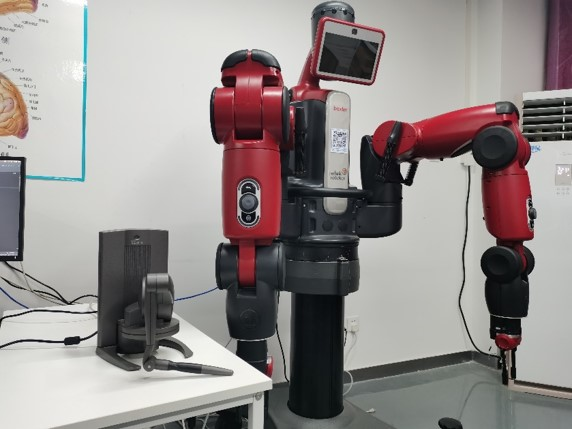

# Geomagic_touch_x-ROS
In this repository, a guidance is given to connet Baxter robot with Geomagic touch X in ROS environment. 
**Geomagic_touch_x/Ubantu16.04/ROS Kinetic**


##  基本的安装流程
###  1.下载相关的驱动和包
在Ubantu16.04环境下运行Geomagic_touch_x并且与ROS连接，需要OpenHaptics、Touch Device Driver这两个官方提供的驱动，以及一个可实现设备到ros的连接的包  
1.[Geomagic_Touch_ROS_Drivers](https://github.com/bharatm11/Geomagic_Touch_ROS_Drivers)  
提供了一个ROS_Drivers的包可实现设备到ros的连接  
2.[OpenHaptics and Touch Device Driver for Linux Developer Edition v3.4](https://support.3dsystems.com/s/article/OpenHaptics-for-Linux-Developer-Edition-v34?language=en_US)   
官网目前提供的Touch Device Driver为2019版，经测试无法在Ubantu16.04上运行  
3.[phantomOmniRos](https://github.com/PolarisYxh/phantomOmniRos)  
提供了与官网相同的OpenHaptics、一个16版本的Touch Device Driver，以及一个实现设备到ros连接的包
###  2.安装需要的依赖
`sudo apt-get install --no-install-recommends freeglut3-dev g++ libdrm-dev libexpat1-dev libglw1-mesa libglw1-mesa-dev libmotif-dev libncurses5-dev libraw1394-dev libx11-dev libxdamage-dev libxext-dev libxt-dev libxxf86vm-dev tcsh unzip x11proto-dri2-dev x11proto-gl-dev x11proto-print-dev`

###  3.安装OpenHaptics及Touch Device Driver
依次进入两个文件目录运行
`sudo ./install`
安装后在opt目录下会分别生成OpenHaptics，Touch Device Driver的驱动文件夹
###  4.创建配置目录和设置环境变量
需要参考官网提供的安装说明，手动创建驱动的配置目录
```
sudo mkdir /usr/share/3DSystems  
sudo mkdir /usr/share/3DSystems/config
```  
将以下环境变量添加到/etc/environment最后一行  
```GTDD_HOME="/usr/share/3DSystems"```
###  5.(仅对64-bit系统) 创建指向OpenHaptics SDK库的符号链接
步骤参考自[Geomagic_Touch_ROS_Drivers](https://github.com/bharatm11/Geomagic_Touch_ROS_Drivers)
```
sudo ln -s /usr/lib/x86_64-linux-gnu/libraw1394.so.11.0.1 /usr/lib/libraw1394.so.8
sudo ln -s /usr/lib64/libPHANToMIO.so.4.3 /usr/lib/libPHANToMIO.so.4
sudo ln -s /usr/lib64/libHD.so.3.0.0 /usr/lib/libHD.so.3.0
sudo ln -s /usr/lib64/libHL.so.3.0.0 /usr/lib/libHL.so.3.0 
```
###  6.运行Setup和Diagnostics
在此之前需连接设备与电脑，点击右上角网络>>Edit　Connections>>选择设备对应的网络（一般是wired connection2)>>edit>>IPV4 Settings>>Method　选择Link-Local Only  
进入下载的Touch Device Driver目录，将geomagic.sh文件复制到home目录下方便打开  
运行  
`sudo ./geomagic.sh`  
自动打开Setup程序  
添加一个属于自己的设备名并选择设备geomagic_touch_x，点击LAN后搜寻设备，选择搜寻到的设备后配对，按设备背后的按键确认。  
Apply、OK后，自动打开Diagnostics程序，可以对设备进行简单的校准和测试
###  7.ROS　Package
将下载的“[Geomagic_Touch_ROS_Drivers](https://github.com/bharatm11/Geomagic_Touch_ROS_Drivers)目录下文件”或“[phantomOmniRos](https://github.com/PolarisYxh/phantomOmniRos)中geomagic_touch-master目录下文件”复制 到你的工作空间src目录下  
在工作空间运行  
`catkin_make`  
进行编译  
然后即可通过roslaunch命令打开设备的rviz并且同步位姿


## Some tips
**1.运行`sudo ./geomagic.sh`时，提示Config directory not set correctly.:　No such file or directory**  

解决：  
检查step.4中的配置目录是否正常创建，以及/etc/enviroment中添加的环境变量是否正确保存  

**2.运行`catkin_make`编译时出现　fatal error: bullet/LinearMath/btMatrix3x3.h:No such file or directory**   

解决：  
缺少必要的依赖，运行`sudo apt-get install libbullet-dev`即可 

**3.运行[phantomOmniRos](https://github.com/PolarisYxh/phantomOmniRos)中launch文件时出现    
Fail to initialize haptic device  
/opt/ros/kinetic/lib/rviz/rviz/symbol lookup error:/opt/ros/kinetic/lib/librviz.so:undefined symbol:_ZNK9QRTreeViewportSizeHintEv**  

解决:  
Ubantu16.04安装相关驱动后出现了Rviz无法正常启动的的问题，尚未有好的结局方案，但可以在终端中用`sudo su`命令进入root用户权限  
再运行`source ~/.bashrc`后，即可使用rviz  

**4运行roslaunch时出现  
HD Error: HD_COMM_ERROR  
Communication Error: Check the device connection and configuration.  
HHD: 0  
Error Code: 302  
Internal Error Code: -28  
Message: Error during main scheduler callback**    

解决：出现该错误一般是Geomagic_Touch_Diagnostic正在运行相关的调试和诊断内容导致的，可以将Geomagic_Touch_Diagnostic程序返回到Mode标签下或直接关闭，之后再运行roslaunch命令即可正常使用  

**5.编译时出现  
error：HLAPI does not name a type**  

-解决：尚未找到好的解决方法，但在实践中，卸载并重装cmake**有一定可能**解决该问题，卸载cmake时也会删除ros的部分内容，请**谨慎选择并做好备份**
